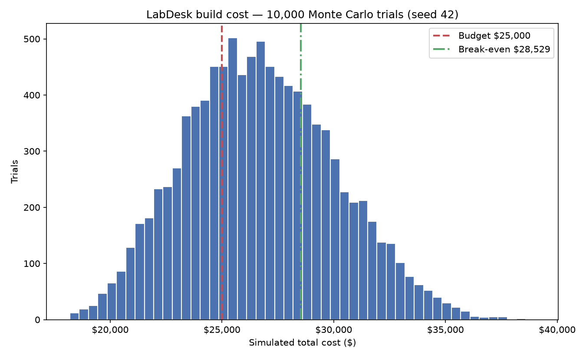

# LabDesk — Project Report

| | |
|---|---|
| **Project** | LabDesk — a help-desk ticket system for the CMPE Department Lab Support Desk |
| **Course** | CMPE 165 — Software Engineering Process Management, San José State University |
| **Assignment** | Project 1 — Software Product from Idea to Execution |
| **Instructor** | Dhruba Borthakur |
| **Author** | Murat Alkan (solo team) |
| **Date** | September 22, 2026 |
| **Repository** | https://github.com/MuratAlkan06/labdesk |

---

## Part A — Mission and Strategic Alignment

The organization is the **CMPE Department Lab Support Desk**, a fictional but unremarkable campus support function: one desk lead and three part-time student lab technicians who keep the department's teaching labs usable — machine and account access, software installs, broken peripherals, licensing. Requests reach it three ways today: email to the lead, messages in the lab Slack channel, and students walking up during office hours.

### A1. Mission

The Lab Support Desk exists so that no student or faculty member loses lab time to a problem the department already knows how to fix.

### A2. Problem

The desk has three intake channels and no single record. A request arriving by Slack is invisible to the technician reading email, so the same fix gets done twice or nobody does it at all; nothing survives the end of a shift; and when the lead is asked which problem has waited longest, the honest answer is that nobody knows.

Three groups live with this. The **desk lead** absorbs it as manual coordination, re-reading inboxes to reconstruct what is outstanding. The **three part-time technicians** absorb it as duplicated and interrupted work, since a walk-in always outranks a thing they cannot see. The **requesters** absorb it as silence: a request with no ticket has no status to ask about, and the only escalation available is to ask again through a different channel.

### A3. Project Objective

LabDesk replaces three intake channels with one queue. A request is submitted through a web form, appears in a single searchable and filterable list, is triaged by assigning a technician and moving the ticket through a guarded status flow (Open → In Progress → Resolved → Closed, plus Resolved → Open to reopen), and is summarized on a dashboard. The delivered features are exactly four — Submit, Queue, Triage, Dashboard — running locally as a Streamlit interface over a SQLite file, with no login, no email sending and no outside services.

### A4. Strategic Alignment

The department's operating goal for its labs is uptime: sections start on time and equipment works. LabDesk supports that goal on three fronts.

| Strategic lever | How LabDesk supports it |
|---|---|
| **Productivity** | The desk's scarcest resource is technician hours, and the current system spends them on coordination rather than fixes. One queue converts that overhead into capacity without adding headcount |
| **Fewer lost requests** | A request living in one inbox is one shift change from disappearing. Making the ticket the unit of work turns the failure mode from silence into a visibly stale ticket, which the desk can act on |
| **Reliability of lab operations** | Uptime is currently an anecdote. Recording creation and resolution times turns "the labs are mostly fine" into a measured claim the chair can budget against, and evidence for the desk when it asks for more student hours |

### A5. Success Metrics

| # | Success criterion | Target | Where it is measured |
|---|---|---|---|
| 1 | Adoption: share of tickets arriving through the web form rather than email or walk-in | ≥ 60% by week 8 | Dashboard — source-share adoption metric |
| 2 | Speed: average time from ticket creation to resolution | < 48 hours | Dashboard — average time to resolution |
| 3 | Coverage: requests that never became a ticket | Zero | Dashboard ticket count, reconciled weekly against the lead's inbox and the Slack channel |
| 4 | Staleness: age of the oldest ticket still Open or In Progress | < 7 days | Dashboard — five oldest open tickets |

All four are read from the application's own dashboard, so measuring them costs nothing extra. Criterion 1 decides whether the rest mean anything — the desk only benefits if the form displaces the old channels — which is why adoption was built into the product as a first-class metric rather than assumed. Criteria 2 and 4 are deliberately paired: an average can look healthy while one request rots for a month.

---

## Part B — Stakeholders, Organization, and Culture

### B1. Stakeholders

| Stakeholder | What they want | Influence | Interest | Stance |
|---|---|---|---|---|
| **Desk lead** (1, full-time) | To stop re-reading three inboxes; to answer "what is outstanding?" in one look; evidence for staffing requests | High — owns the desk's process and can mandate the tool | High — the coordination burden is theirs daily | **Support**, strongly; the likely sponsor |
| **Student lab technicians** (3, part-time) | Fewer interruptions, no duplicated work, and not to be measured unfairly | Medium — can quietly ignore the queue and answer walk-ins instead | High — it changes how their shift works | **Mixed**: support the queue, resist being metered |
| **Student and faculty requesters** | A fix, and a way to find out where their request stands | Low individually, high in aggregate — if they keep walking up, adoption fails | Episodic: high while blocked, near zero otherwise | **Neutral** — will follow the path of least effort |
| **Department chair** (budget owner) | Lab uptime and defensible spending; no new recurring cost | High — funds or kills the project | Low-to-medium — cares about outcomes, not tickets | **Conditional**: supports if the NPV case holds |
| **University IT** | Compliance with campus data and hosting policy; no shadow system on the network | High — can veto deployment or impose requirements | Low — one small desk among many | **Neutral-to-resist**: a locally built tool is a policy question |

### B1b. Power–Interest Matrix

| | **High interest** | **Low interest** |
|---|---|---|
| **High power** | **Manage closely** — Desk lead | **Keep satisfied** — Department chair; University IT |
| **Low power** | **Keep informed** — Student lab technicians | **Monitor** — Student and faculty requesters |

Two placements drive the plan. The technicians sit in *keep informed*: low formal power, but the ability to make the project fail by habit — which is why the metric policy in Parts E3 and G matters more than any feature. The requesters sit in *monitor* only because each is individually powerless and intermittently attentive; in aggregate their behaviour *is* success criterion 1, so the project's job is to make the form the easiest path, not to persuade anyone.

### B2. Organizational Structure

**Functional.** The desk already sits inside the department, reporting to the chair through the desk lead, and LabDesk stays inside that line: the lead is both operational owner and product owner, and the build is work the desk does for itself.

*Advantage:* the shortest path from user to decision. The person who feels the problem, specifies the tool and accepts the result is one person, so requirements need no translation layer and a wrong assumption is corrected in a hallway conversation rather than a change-control meeting.

*Disadvantage:* nobody is dedicated. The project competes with daily desk traffic, and lab traffic is spiky — a bad week of broken workstations stalls the build outright. That is exactly the key-person dependency scoring 12 in Part H, and the functional structure creates it.

*Why not the alternatives:* **projectized** would give a dedicated team and a clear schedule owner, but a two-week prototype does not justify a standalone project organization and a $25,000 build cannot fund one. **Matrix** would add dual reporting and negotiated resource splits to a four-person desk — more coordination overhead than the problem it solves.

### B3. Organizational Culture

| | Cultural characteristic | Effect on the project |
|---|---|---|
| **Helps** | Measurement tolerance | The desk already keeps informal notes on what broke and when, and the department speaks about labs in terms of uptime. Recording a ticket formalizes an existing habit rather than importing a foreign one |
| **Helps** | Low ceremony | A four-person unit changes direction in a day. During this build that was literal: when a live review found a defect, it was specified, fixed, verified and logged inside one working session |
| **Helps** | Student-staff learning orientation | The technicians are CMPE students, so a Python, SQLite and Streamlit tool is legible to the people who operate it — they can run the seed script, read the logic module and run the tests. The tool becomes something they maintain rather than something imposed, which also blunts the key-person risk |
| **Hurts** | The walk-up habit | Students walk to the desk because it works today, and technicians answer because answering is faster than triaging. Every walk-in handled off-queue is a ticket that never exists |

The walk-up habit is the one that decides the project. It attacks success criteria 1 and 3 at once, and software cannot fix it: it requires the desk lead to route walk-ins into the form at the counter, a behaviour commitment the sponsor must make and keep.

---

## Part C — Project Selection

Management cannot fund every idea the desk has, so two competing projects were scored.

**Project A — LabDesk** (this project): one queue for lab support requests, with submit, search and filter, guarded triage, and a dashboard reporting workload, resolution time, ticket age and the web-form adoption share.

**Project B — LabTrack**: a lab equipment inventory and checkout system, cataloguing the department's loanable hardware — oscilloscopes, FPGA boards, cables, lab kits — and tracking who has what, when it is due back, and what has gone missing. Also a real problem, and one the department loses money to every semester.

The weighted scoring model uses five criteria; weights total 100%, and scores run 1–10 where 10 is best.

| Criterion | Weight | Score A (LabDesk) | Weighted A | Score B (LabTrack) | Weighted B |
|---|---:|---:|---:|---:|---:|
| Strategic alignment | 25% | 8 | 2.00 | 6 | 1.50 |
| Financial value | 20% | 7 | 1.40 | 6 | 1.20 |
| Two-week feasibility | 20% | 9 | 1.80 | 7 | 1.40 |
| Adoption likelihood | 15% | 6 | 0.90 | 7 | 1.05 |
| Operational urgency | 20% | 9 | 1.80 | 5 | 1.00 |
| **Total** | **100%** | | **7.90** | | **6.15** |

The weights encode the desk's actual constraints. Strategic alignment carries the most weight because a support desk's mandate is responsiveness, not asset management. Feasibility and urgency carry 20% each because the window is two weeks and the pain is present-tense. Adoption likelihood is weighted lowest at 15% — not because it matters least, since Part H ranks low adoption as the largest threat, but because it is the criterion the project can most directly influence once built. It is also the only criterion where LabTrack scores higher: checkout is enforceable at the point of handover, whereas LabDesk has to win a habit.

**Which project should management choose?** LabDesk, at 7.90 versus 6.15. The margin comes from urgency and feasibility: lost requests cost lab time every day, while a missing oscilloscope costs money once a semester, and a four-feature queue is buildable in two weeks by one person where a checkout system with due dates, reminders and custody records is not. LabTrack is not rejected — it is the next project, and it inherits LabDesk's data layer.

*Calculation: `analysis/weighted_scoring.py`.*

---

## Part D — Financial Analysis

| Input | Value | Justification |
|---|---:|---|
| Initial development cost | $25,000 | About 300 developer hours at a blended campus contractor rate, plus tooling — the cost of building the full version properly rather than as a course prototype |
| Annual gross benefit | $12,000 | Coordination time returned to the desk: roughly 4 hours/week across the lead and technicians no longer spent reconstructing what is outstanding or redoing duplicated work, at campus labour rates |
| Annual maintenance | $3,000 | Hosting, backups and a modest allowance for fixes and small changes — about a fifth of a part-time maintainer |
| Annual net cash flow | $9,000 | $12,000 benefit less $3,000 maintenance |
| Discount rate | 10% | A conventional internal rate for discretionary university IT spending; high enough to penalize a payoff arriving late |
| Horizon | 4 years | The realistic service life of a small internal tool before the department's needs or platform change |

$$NPV = -C_0 + \sum_{t=1}^{n} \frac{CF_t}{(1+r)^t}$$

| Year | Cash flow | Discount factor | Present value |
|---:|---:|---:|---:|
| 0 | −$25,000 | 1.0000 | −$25,000 |
| 1 | $9,000 | 0.9091 | $8,182 |
| 2 | $9,000 | 0.8264 | $7,438 |
| 3 | $9,000 | 0.7513 | $6,762 |
| 4 | $9,000 | 0.6830 | $6,147 |
| | | **PV of benefits** | **$28,529** |
| | | **Less initial cost** | **−$25,000** |
| | | **NPV** | **+$3,529** |

Two sensitivity figures matter more than the headline. The **break-even initial cost is $28,529** — the build price at which NPV reaches exactly zero. The **break-even annual net cash flow is $7,887** — the yearly net benefit below which the project destroys value. The **undiscounted payback period is 2.78 years**, consuming most of the four-year horizon.

**Based only on NPV, should management fund this project?** Yes — but marginally, and the qualifier is the finding. A +$3,529 return on a $25,000 build is thin: it is erased entirely by a cost overrun past $28,529, or by annual benefit landing below $7,887 — a shortfall of barely a thousand dollars a year against the $9,000 estimate. NPV answers whether the project is worth doing *if the estimates hold*, and says nothing about whether they will. That is why this report does not stop here: Part I asks whether to buy information before committing, and Part J asks how likely the $25,000 estimate is to survive contact with the work. Both were motivated by how little slack this number leaves.

*Calculation: `analysis/npv.py`.*

---

## Part E — Leadership and Ethics

### E1. Leadership

For a four-person desk where three members are part-time students, the right style is **servant leadership with situational adjustment**. The lead's job is to remove obstacles, hold the scope boundary and protect scarce student hours, not to direct work hour by hour. The situational part is real: a first-semester technician facing an unfamiliar licensing failure needs step-by-step direction, while a returning technician handling a routine lockout should be left alone.

| Question | How it works at this desk |
|---|---|
| How decisions are made | Product decisions — what the tool does and what it measures — belong to the desk lead, who owns the outcome. Technical decisions belong to whoever builds the affected area, under the rule that any decision worth arguing about is written down with the rejected alternative and the reason. Not theoretical: this project's build log holds roughly forty such entries |
| How much authority members have | Each technician owns their tickets end to end — choosing the fix, deciding when to escalate, reprioritizing their own queue without asking. What they do not own is the status flow or the metric policy: those are shared contracts, and one person changing them unilaterally breaks everyone else's reading of the data |
| How disagreements are handled | Surface the interest underneath the position (Part G) and decide at the lowest level that owns the consequence: technical to whoever owns the area, product to the desk lead, budget or policy to the chair |

**What the project manager does when behind schedule.** Cut scope, never quality — which is what this build did. The feature count was frozen at four before any code existed, under the written rule that a fifth feature is a defect even when it works. When the schedule tightened, two items were dropped explicitly and recorded as descopes: continuous-integration automation, and a multi-variant UI exploration replaced by one design reviewed live. What was never cut was verification. Cutting the gate is how a schedule problem quietly becomes a quality problem.

### E2. Leadership Antipattern

The antipattern that would most damage this desk is **hero culture reinforced by micromanagement** — the lead taking every hard ticket personally because it is faster, while checking the students' work item by item because they are part-time.

The consequences compound. Knowledge concentrates in one person and stops being written down, which is the key-person dependency scoring 12 in Part H. The technicians never handle a hard ticket, so they never become able to, and the lead's belief that they cannot becomes self-fulfilling. Micromanaged part-timers disengage from a job that pays little and is meant to teach them something, so semester turnover accelerates. And the queue decays: a lead who is heads-down fixing things is not routing walk-ins into the form, which sends criterion 1 backward. The failure is quiet, and it looks like dedication the entire time.

### E3. Ethical Challenge

**The ethical problem.** LabDesk timestamps every ticket's creation and resolution, so a per-technician resolution-speed ranking is about ten lines of code away. It is the most commonly requested support dashboard there is, and building it here would be wrong, because the measurement is invalid and the incentive is perverse. Ticket difficulty is wildly uneven: an account lockout closes in four minutes, a licensing server failure takes three days waiting on a vendor, and neither says anything about the technician. The three work different part-time schedules, so a ticket sitting over a weekend punishes whoever holds it rather than whoever caused the delay. And it is trivially gameable — cherry-pick easy tickets, avoid hard ones, close prematurely and let the requester reopen. A metric that rewards avoiding hard work inside a support desk is not a neutral tool being misused; it is a tool whose predictable use is harmful.

**Stakeholders affected.** The three technicians most directly: students, paid hourly, with the least power and the most to lose from a number that follows them into a reference letter. Then requesters, who inherit the gaming, since the hard problems are the ones that stop a lab section. Then the desk lead, whose accountability need is met by a number that does not measure what they think. And the department, which would make staffing decisions on a statistic it cannot defend.

**What the project manager should do.** Decide the metric policy before building the dashboard — the time to refuse a bad metric is while it is still hypothetical, not when a specific person wants a specific answer about a specific student. That is what happened here. The recorded decision: **the dashboard reports open workload per technician and never ranks technicians by resolution speed**; team-level average resolution time is shown because desk performance is a shared outcome. It was written into the project's coding principles before any code existed, documented in the README as a deliberate absence, and enforced mechanically — an automated keyword check fails the build if ranking language appears in the application source. That check first failed on a docstring explaining the ban, which is the clearest evidence the gate runs. A policy nobody can quietly reverse is worth more than one everyone agrees with today.

---

## Part F — Team Design

The full version — the one the $25,000 buys, with accounts, email notification, backups and campus hosting — needs four to five people.

| Role | Who | Owns |
|---|---|---|
| Product owner | The desk lead | Requirements, priority order, acceptance, the metric policy |
| Tech lead | Senior engineer | Architecture, the data model, technical decisions, code review |
| Engineers | 2 | Implementation and their own tests |
| Project manager | Part-time, shared | Schedule, risk register, stakeholder communication, escalation |
| Quality | Shared, plus an independent gate | Tests owned by whoever writes the code; release verification owned by someone who did not |

| Question | Answer |
|---|---|
| Who makes technical decisions | The tech lead, after the engineer closest to the code recommends. Decisions that constrain everyone — where status transitions live, what the time seam is, where module boundaries fall — are written down with the rejected alternative, so a later engineer inherits the reasoning and not just the result |
| Who determines product requirements | The product owner, singular. The desk lead is the only person who can say what the desk needs, and splitting that authority is how a small internal tool acquires features nobody asked for |
| Who manages schedule | The project manager, who also owns the Part H register and whose job includes saying "cut scope" out loud when the date is in danger |
| How disagreements are resolved | Technical to the tech lead, product to the product owner; the project manager owns how a disagreement is aired and the deadline by which it is settled. Budget, policy, or a conflict between what the desk wants and what the department will pay for escalates to the chair |

**Who owns quality.** Shared, with one deliberate exception. Engineers write and own their tests — quality is not a department that catches other people's mistakes. But release verification belongs to someone who did not build the thing, and that separation is not a formality. On this build the defect that reached a user-visible screen was found by an independent live review while all 28 automated tests passed, because the tests covered the logic layer and the defect lived in the interface. The full team keeps that shape: an independent verification pass from a fresh clone before any release, plus a design review of the running application. Author-tested code is a blind spot with excellent coverage.

**Co-located, distributed, or hybrid?** **Hybrid**, and the split is functional rather than a compromise. The product owner and at least one engineer need regular physical presence at the desk, because the requirements here are behavioural: you cannot design the intake path without watching a student walk to the counter instead of using the form, and that habit is the project's largest threat. Build work is better done remotely in long uninterrupted blocks, because a support desk is by nature interrupt-driven. Hybrid buys the empathy without paying for the interruptions.

---

## Part G — Conflict and Negotiation

**The disagreement.** Two weeks after launch the desk lead asks for a dashboard panel ranking the three technicians by average resolution time, to "motivate" the desk and surface who needs help. The technicians object immediately.

**What each side wants.** The lead wants to know whether the desk is performing, to spot a technician who is struggling before it becomes a lab outage, and to have something defensible to show the chair when asking for more student hours. The technicians want not to be ranked against each other on a number that does not describe their work — different shifts, different tickets, and the hardest problems take longest by definition. They also fear, reasonably, that the number outlives its context and surfaces in a reference letter long after anyone remembers which tickets produced it.

**Why the conflict exists.** Both sides are right about something, which makes it a conflict rather than a misunderstanding. The lead has a legitimate accountability need and no instrument that meets it. The technicians have a legitimate measurement-validity objection: comparing individuals on a metric driven mostly by ticket difficulty and shift timing is not accountability, it is noise with names attached. The positions are incompatible — publish the ranking, do not publish it — while the interests underneath are not.

**How the project manager should resolve it.** Interest-based, not positional. Positional bargaining yields either a ranking nobody trusts or a lead with no visibility. The move is to stop negotiating over the panel and ask what each side needs in order to be satisfied without it: the lead needs early warning about stalling work plus evidence about capacity; the technicians need any published number to be one they can move through good work rather than ticket selection. Those requirements do not conflict — the ranking was just the first instrument that came to mind.

**The negotiated solution.** Three metrics replace the ranking, and the desk accepted all three.

| Metric | Whose concern it satisfies |
|---|---|
| **Per-technician open workload** — Open plus In Progress tickets each technician carries, with an Unassigned bucket | The lead sees who is overloaded and who can absorb the next escalation, which is most of what "who needs help" meant. It measures load, not speed, so taking the hard ticket raises the number instead of damaging a score |
| **Team-level average time to resolution** — one number for the desk | Performance is reported, and reported as a shared outcome, which is how it behaves when three people cover one queue |
| **Oldest-ticket alerts** — the five oldest tickets still open, by age | The early-warning instrument the lead actually needed: a stalled request appears as a stalled request and is addressed as a specific ticket, without inferring anything about a person from an average |

Neither side won. The lead did not get the ranking and did get earlier, more specific visibility than a monthly average would have given — a two-week-old ticket appears as a two-week-old ticket, not a decimal point. The technicians did not get exemption from measurement and did get measurement they can defend, since nothing published rewards avoiding hard work. That settlement is what shipped, which is why the delivered dashboard shows workload, team-level resolution time and oldest open tickets, and no speed comparison anywhere.

---

## Part H — Risk Identification

$$Risk\ Score = Probability \times Impact$$

Probability and impact are each scored 1–5. The register covers the full version of the product, not only the two-week prototype.

| Rank | Risk | Category | P | I | Score |
|---:|---|---|---:|---:|---:|
| 1 | Low adoption — the desk keeps using email, Slack and walk-ins instead of the form | Organizational | 4 | 5 | **20** |
| 2 | Build cost exceeds the $25,000 budget | Financial | 4 | 4 | **16** |
| 3 | Key-person dependency — one person holds the tool's knowledge and time | Resource | 3 | 4 | **12** |
| 4 | Scope creep beyond the four agreed features | Scope | 3 | 3 | 9 |
| 5 | SQLite data loss — a single unbacked database file | Technical | 2 | 4 | 8 |
| 6 | AI-generated defect ships despite a green test suite | Quality | 3 | 2 | 6 |
| 7 | Requester personal information mishandled or over-collected | Compliance | 2 | 3 | 6 |

**The three highest-priority risks are low adoption (20), cost overrun (16) and key-person dependency (12)**, handled in Part K.

Two entries deserve comment. Risk 2's probability score is not a guess: the simulation in Part J puts P(cost > $25,000) at **67.8%**, which justifies a 4 rather than the 2 or 3 intuition suggests. And risk 6 — the lowest-scored risk here — is the one that **actually occurred during this build**, as the reflection below describes. Its control cost almost nothing and caught a defect that 28 passing tests did not.

*Calculation: `analysis/risk_register.py`.*

---

## Part I — Decision Tree

**The uncertain management decision.** Adoption is the largest risk on the register and is unknowable in advance. Management can commit the full $25,000 now, or spend $2,000 on a four-week pilot with the existing prototype, observe the actual web-form share, and commit only if adoption looks real. The pilot buys information; the question is whether the information is worth $2,000.

**Probabilities and outcomes.** P(high adoption) = 0.6, from the desk lead's judgment that the walk-up habit is strong but the form is less effort for anyone not already at the counter. Under high adoption the full benefit lands and the build returns its NPV of **+$3,528.79**. Under low adoption only 40% of the benefit lands, while maintenance stays at the full $3,000 because a lightly used system still has to be hosted and maintained. That gives **−$19,294.24**.

```
                                    High adoption (0.60) -> +$3,528.79
                    COMMIT NOW  ---<
                   /                Low adoption  (0.40) -> -$19,294.24
                  /                       EMV = -$5,600.42
  DECISION  -----<
                  \                 High adoption (0.60) -> build -> +$1,528.79
                   \  PILOT     ---<      (NPV $3,528.79 less $2,000 pilot)
                    ($2,000)        Low adoption  (0.40) -> stop  -> -$2,000
                                          EMV = +$117.27
```

| Decision | Branch | Probability | Outcome | Contribution |
|---|---|---:|---:|---:|
| Commit now | High adoption | 0.60 | +$3,528.79 | +$2,117.27 |
| Commit now | Low adoption | 0.40 | −$19,294.24 | −$7,717.70 |
| | **EMV (commit)** | | | **−$5,600.42** |
| Pilot | High adoption → proceed | 0.60 | +$1,528.79 | +$917.27 |
| Pilot | Low adoption → stop | 0.40 | −$2,000 | −$800.00 |
| | **EMV (pilot)** | | | **+$117.27** |

**Which decision should management make according to the decision tree?** Run the four-week pilot. Committing now has an EMV of **−$5,600.42**; piloting first has **+$117.27**. The sign flip is the whole result: commitment carries negative expected value despite a positive base-case NPV, because the 40% branch is catastrophically asymmetric — failed adoption does not merely shrink the benefit, it leaves the department paying maintenance on a system nobody uses. The $2,000 pilot is not a smaller version of the project; it is the purchase of an option to stop, converting a $19,294 downside into a $2,000 one. That asymmetry, not the size of the upside, is what makes the pilot correct.

Two caveats: the pilot's +$117.27 is barely above zero, so the tree does not say the project is attractive, only that the pilot is the least bad way to find out; and P(high adoption) = 0.6 is a judgment, not a measurement, so the pilot's real product is replacing that guess with an observed number.

*Calculation: `analysis/decision_tree.py`.*

---

## Part J — Monte Carlo Simulation

**The uncertain outcome selected: total build cost.** The $25,000 in Part D is a point estimate, and every conclusion resting on it — a +$3,529 NPV, a $28,529 break-even — inherits its error. Each trial computes `cost = hours × rate × rework + $2,500` in fixed tooling cost.

| Variable | Distribution | Why this is reasonable |
|---|---|---|
| Developer hours | Triangular, low 220 / mode 300 / high 380 | Triangular fits an expert estimate: a most-likely value with bounded, asymmetric error. 300 hours matches the $25,000 point estimate, and the bounds allow roughly a quarter less and a quarter more |
| Blended hourly rate | Uniform, $65–$85 | The rate depends on who is hired and on campus contracting terms, with no reason to prefer any value inside the band — uniform states that honestly instead of inventing a peak |
| Rework multiplier | Triangular, 1.00 / mode 1.03 / high 1.20 | Rework is multiplicative, not additive: it scales with work already done. The mode sits near 1.00 because the base case assumes competent execution, and the tail to 1.20 captures the realistic failure mode of a requirements change or a rebuilt interface layer |

Ten thousand trials were run with a fixed random seed (42), so every figure reproduces exactly on re-run.

| Statistic | Value |
|---|---:|
| Mean cost | $26,734 |
| Median cost (P50) | $26,594 |
| P10 (optimistic) | $22,413 |
| P80 | $29,640 |
| P90 (pessimistic) | $31,276 |
| P(cost > $25,000 budget) | **67.8%** |
| P(cost > $28,529 break-even) | **29.4%** |



*Chart: `analysis/monte_carlo.png` — histogram of the 10,000 simulated costs with the $25,000 budget and $28,529 break-even lines marked.*

**What management decision should change based on the simulation?** Two things.

**Budget at the P80, not the point estimate.** The $25,000 figure is not a plan, it is a lucky outcome: it sits below the median, and 67.8% of trials exceed it. The request to the chair should be **$29,640** — the P80 — with the stated understanding that roughly one run in five still exceeds even that. Approving $25,000 and being surprised is a choice to have the overrun conversation later, with less credibility, mid-project. Note that the mean ($26,734) sits above the median ($26,594) because the rework tail drags it there: the expensive outcomes are expensive because work gets redone, not because the hours were badly guessed.

**The overrun probability reinforces pilot-before-commit.** Part I recommended the pilot on adoption risk alone; the simulation adds an independent reason. Break-even is $28,529, and **29.4% of trials exceed it** — close to a third of the time the project is underwater on cost before adoption is considered. Two independent uncertainties, each individually capable of erasing a +$3,529 NPV, make a strong case for spending $2,000 to learn something before spending $25,000 to assume it.

*Calculation: `analysis/monte_carlo.py`.*

---

## Part K — Risk Mitigation and Monitoring

| Risk | Mitigation | Contingency | Early-warning signal |
|---|---|---|---|
| **1. Low adoption** (20) | Make the form the path of least resistance and close the alternatives: a QR code and tablet at the desk so a walk-in becomes a ticket in thirty seconds rather than being turned away; the lead forwarding email requests into the form instead of answering them; a Slack auto-reply pointing at the form | If the web-form share stalls below 40% by the end of the pilot, do not commit the $25,000 — that is the branch the tree prices at −$19,294.24, and the pilot exists in order to be allowed to fail. Keep the prototype running at near-zero cost for the technicians who do use it, and spend the money on LabTrack | The dashboard's **source-share metric, read weekly**. Flat or falling web-form share in pilot weeks 2–3 is a signal to act then, not at week 8. The specific tell is a rising walk-in count in a week when total volume is flat: the desk is capturing requests, but not through the form |
| **2. Cost exceeds $25,000** (16) | Budget the full build at the **P80 of $29,640** rather than the point estimate, and attack the rework multiplier directly, since it creates the expensive tail: freeze the feature list before implementation starts, and keep the independent verification gate, because rework found late costs multiples of rework found at review | Cut scope, not quality (the E1 rule). The optional tier is pre-ordered for descope — email notification first, then accounts — so a tightening budget triggers a decision about which pre-agreed item drops, not a renegotiation under pressure | **Actual hours tracked weekly against the 300-hour mode**, with the P80 and the 380-hour bound as marked thresholds. Passing 300 hours before the feature list is complete means the trial being lived is in the right tail. Second tell: hours spent redoing already-accepted work, tracked separately, since that is the variable driving the overrun |
| **3. Key-person dependency** (12) | Make the knowledge executable rather than remembered. The repository already carries a README whose run instructions were verified by executing them verbatim on a clean machine, a seed script that rebuilds a complete demo database with one command, and a suite stating expected behaviour in 28 named assertions. A second person runs all three cold before the pilot ends | The technicians can operate the desk on the existing queue with no development capability at all, and the documented setup lets a replacement resume rather than restart. The recovery path is deliberately low-skill: one command to seed, one to run | **Concentration**, as a proxy: if every change for a month came from one person, or nobody else has successfully run the cold-start instructions in that time, the dependency is already real. This risk has no dashboard tile, and saying so is more useful than pretending otherwise — it is monitored by asking at the monthly review |

The handover test for risk 3 is worth stating plainly: whether someone who did not build the system can bring it up from a fresh clone. That was verified once during this build and should be repeated by a different person before the pilot ends.

**How the project manager monitors these.** Three cadences, all cheap. **Weekly:** read the dashboard — source share, oldest open ticket, average resolution time — and log hours against the 300-hour mode. The application is the monitoring instrument for two of the three top risks, which was a design goal rather than a coincidence. **At each pilot week:** re-score the register's probability column against what was observed, so P(high adoption) stops being a judgment and becomes a measurement. **At the pilot gate:** re-run the Part I decision against observed adoption instead of the assumed 0.6. The register is a living document, not an artifact produced once for a report; a risk whose probability is never updated is a risk nobody is managing.

---

## What Did Vibe Coding Teach You?

### Before coding — what did I think would be easy?

I thought four features over one SQLite table would be the easy part, and I was right. The logic layer — schema, validation, the status transition table, dashboard aggregation — went green on the first run of its 28 tests, and the seed script produced byte-identical databases on two consecutive runs at the first attempt. The estimate I got right was the one about writing code; almost everything that went wrong lived outside it.

### During development — what turned out to be harder than expected?

Cross-layer consistency and documentation parity, neither of which I had budgeted a minute for.

The clearest case: the ticket detail screen computed "days open" as now minus creation time for *every* ticket, including resolved ones. A ticket fixed in 30 hours displayed "Days open: 14.6" directly beneath "Resolved at: 2026-09-08 15:45". All 28 tests passed with the defect in place, because they cover the logic module and the defect lived in the interface layer; it touched all 18 resolved and closed tickets, and a live browser review found it. Test coverage is not behaviour coverage.

Documentation rotted just as fast. A security-review fix added a command-line flag to the README's run command, silently invalidating the sample output quoted two lines below it: the re-verification confirmed the command still served, but not that the prose still matched what it printed. And the README's startup step failed the first time anyone ran it verbatim, because with no existing configuration the framework prints a welcome prompt and waits for input instead of binding a port. My smoke test had missed that by passing a headless flag which suppresses the prompt — I had tested a configuration no grader would use.

### AI — what did the tools do well, and what did they do poorly?

**Well.** Five standalone analysis scripts producing contract-exact figures, deterministic under a fixed seed. A test suite that builds a real temporary database per test rather than mocking storage. And small diffs under instruction: the days-open fix was 21 lines added and 3 removed across two hunks of one file, leaving the already-correct call site byte-identical.

**Poorly.** Twice the model's own docstrings tripped the keyword checks it had been asked to enforce — a docstring explaining the no-rankings policy used the exact words the ranking check greps for, and a module docstring promising the file contains no database access contained the token the boundary check forbids. Both times a correct implementation would have failed its own gate, and both times the cause was identical: stating a prohibition by quoting the banned term. It made that mistake in two separate files, having already been corrected once.

The deeper pattern matters more. The model optimized for passing the stated check rather than for the coherence of the artifact. The bar charts passed every assertion while sorting statuses alphabetically — Closed, In Progress, Open, Resolved — destroying the workflow order the domain is built on, because nothing in the spec said "sorted correctly". The days-open defect survived 28 green tests. Both times the check was satisfied and the artifact was wrong, and only a human-directed review of the running application caught it. AI assistance did not remove the need for independent verification; it moved defects to where automated verification does not look.

### Estimation — was my original estimate accurate?

The Part J simulation describes my own two weeks in miniature. The coding estimate was accurate; the estimate for everything around it — review rounds, re-verifying documentation after a code change, a cold-run failure, two gate failures caused by docstrings — was not so much wrong as absent, because I never modelled that work as a category. That is why the simulation treats rework as a *multiplier* rather than an additive contingency: every overrun I experienced was redone work, and redone work scales with how much work there is. A point estimate of $25,000 has a 67.8% chance of being exceeded, and the P80 is $29,640. A single-number estimate is not a plan; it is an optimistic sample from a distribution nobody drew.

### Risk — did any risk actually occur?

Yes: **register risk 6, "AI-generated defect ships despite a green test suite"** (P=3, I=2, score 6) — the lowest-scored technical risk and the only one that materialized, which is a lesson about registers as much as about defects. The days-open defect would have been visible in the first thirty seconds of a demo. Detection cost almost nothing, because the control was in place before the risk occurred: verification independent of implementation, by a reviewer who had not built the thing. Scoring a risk low is not a reason to skip its control; it is a reason to size the control cheaply.

### Scope — did I change or reduce the scope?

The feature count was frozen at exactly four before any code existed, written into the project's coding principles as the rule that a fifth feature is a defect even when it works. It never moved. What moved was everything optional around it, explicitly: CI automation was descoped because grading is a local cold run and the definition of done already required an independently verified green suite from a fresh clone; a multi-variant UI exploration was replaced by one design reviewed live; six cosmetic and accessibility findings were accepted rather than fixed, each with its tradeoff logged.

The class concept is scope control through a written boundary plus a change record, and its value here was not preventing creep — one person building alone is not the usual creep scenario — but making every schedule pressure land somewhere harmless. What got cut was CI and polish; what never got cut was the verification gate.

---

## Final Recommendation

**GO WITH CONDITIONS.**

Proceed to a four-week, $2,000 pilot of the existing prototype. Commit the full build only if the pilot shows adoption trending toward the ≥60% web-form share of criterion 1; if it does, budget that build at **$29,640** — the P80 — not at the $25,000 point estimate. Keep the metric policy: workload and team-level resolution time, no individual speed rankings, enforced by the automated check already in the verification gate.

- **Strategy.** The project serves the department's lab-uptime goal through productivity, fewer lost requests and measurable reliability, and all four success criteria are read from the product's own dashboard.
- **Stakeholders.** The group that can silently kill the project — technicians and walk-in requesters — is governed by habit, so adoption is a behavioural commitment, not a feature that can be shipped.
- **Project selection.** LabDesk scores **7.90** against LabTrack's **6.15**, driven by operational urgency and two-week feasibility.
- **Financial analysis.** NPV is **+$3,529** — positive, and thin enough that a cost overrun past $28,529 or an annual benefit below $7,887 erases it entirely.
- **Leadership and ethics.** The metric policy was decided before the dashboard was built and is enforced mechanically, which is the difference between an ethical position and an ethical intention.
- **Team design.** Four to five people, hybrid, with release verification owned by someone who did not build the thing — a separation that demonstrably worked here.
- **Development experience.** Four features, 28 passing tests, a fresh-clone verification, and a user-visible defect only an independent live review caught.
- **Risk analysis.** The top-scoring risk is low adoption at **20**, a behaviour risk rather than a technical one — exactly what a pilot is designed to measure.
- **Decision tree.** Committing now carries an EMV of **−$5,600.42**; piloting first carries **+$117.27**. The $2,000 buys the option to stop, converting a −$19,294.24 downside into a −$2,000 one.
- **Monte Carlo.** **67.8%** of 10,000 trials exceed the $25,000 budget and **29.4%** exceed the $28,529 break-even, so adoption and cost can each individually erase the return.

The assignment notes that recommending anything other than unconditional continuation is a valid conclusion. This is not caution for its own sake: a prototype that works, a positive NPV, and a negative EMV on immediate commitment can all be true at once, and the only decision consistent with all three is to spend a small amount learning whether the largest assumption holds before spending a large amount assuming it does.

---

## Calculation Appendix

Every number above is produced by one of five standalone Python scripts in `analysis/`. Each runs on its own from the repository root, prints an aligned plain-text table, and is deterministic — the simulation fixes its random seed as the first executable statement of main — so every figure quoted in this report reproduces exactly, and the outputs are quoted verbatim. The rendered output of all five scripts is collected in `APPENDIX.md` at the repository root, so the appendix can be read without running anything.

| Script | Produces | Report section |
|---|---|---|
| `analysis/weighted_scoring.py` | Weighted scoring model; totals 7.90 (LabDesk) vs 6.15 (LabTrack) | Part C |
| `analysis/npv.py` | Discounted cash-flow table, NPV +$3,529, break-evens, payback 2.78 years | Part D |
| `analysis/risk_register.py` | Risk register with P × I scores and ranking | Part H |
| `analysis/decision_tree.py` | EMV of commit (−$5,600.42) vs pilot (+$117.27) | Part I |
| `analysis/monte_carlo.py` | 10,000-trial cost simulation, summary statistics, and `analysis/monte_carlo.png` | Part J |

```bash
.venv/bin/python analysis/weighted_scoring.py
.venv/bin/python analysis/npv.py
.venv/bin/python analysis/risk_register.py
.venv/bin/python analysis/decision_tree.py
.venv/bin/python analysis/monte_carlo.py
```
